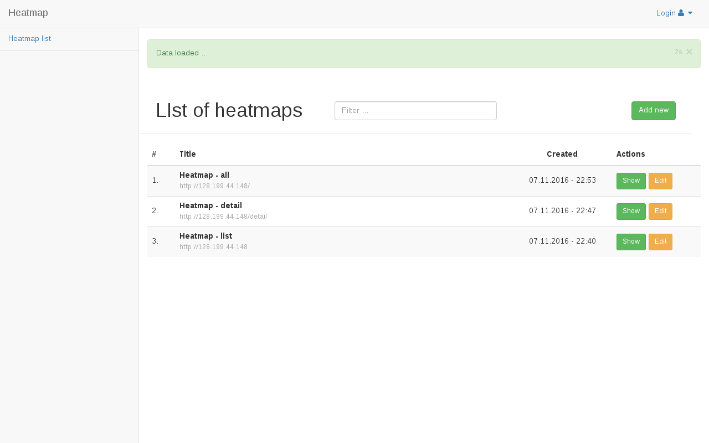

# heatmap

# Instalation

Gulp has to be installed globaly 
If you don't have gulp:

    npm i gulp -g

Clone and Install

    git clone https://github.com/juraj0137/heatmap.git
    cd heatmap
    npm install

Build

    gulp build      # dev build
    -- or --   
    gulp p build    # prod build

If you want to develop, it's nice to watch changes on your files
    
    gulp watch      # dev
    -- or -- 
    gulp p watch    # prod

# Running

Requirement: Elascticsearch has to run, and listen at localhost.
  
Start web server

    npm run start-server:win
    --  or --
    npm run start-server:linux

# Client tracking script
Location of file 

    build/client/bundle.js
    
# Configuration
1) Client tracking script

    src/client/config/config.js
    
You need to change `collectUrl` to localhost if you want to develop it.
2) Admin

    src/admin/config.js
    
`basePath` is address where is running your server

3) Elastic ip address

    src/db/elastic/BaseElasticService.js
